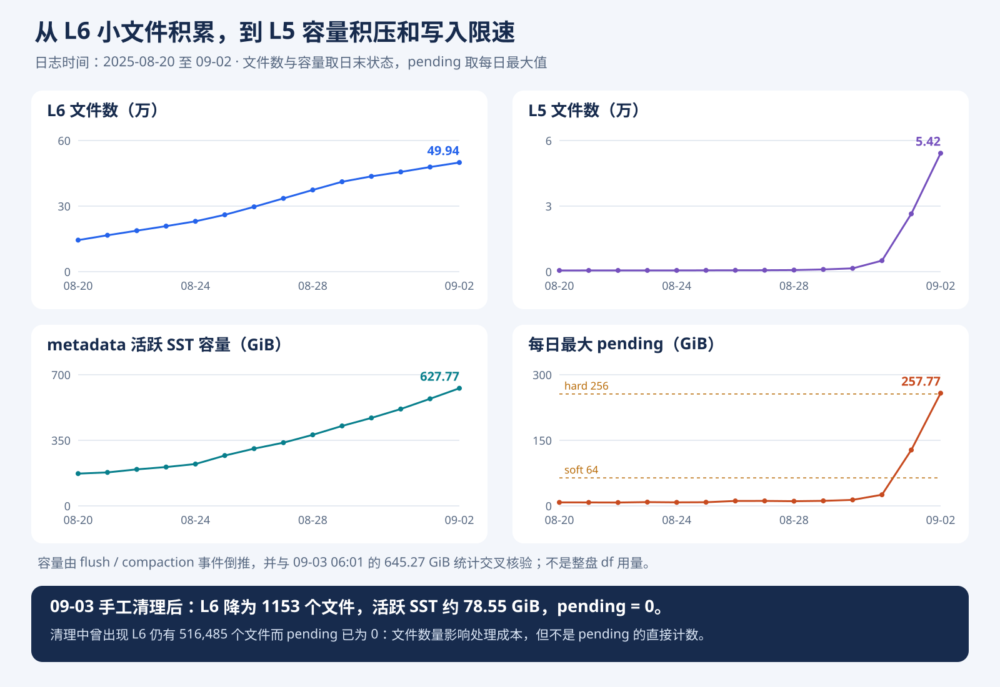

# temp/db：50 万级 L6 文件、空间增长与写入降速分析

分析对象：`temp/db` 中 12 份 RocksDB LOG，共 3,154,856,205 B。日志覆盖 2025-08-20 04:43 至 2025-09-09 06:42，主要数据活动截至 09-03 09:24。RocksDB 版本为 9.3.1，DB Session ID 在这些滚动日志中一致。本文基于本地只读解析，没有操作远程实例，也没有修改配置。

**结论：用户关于 L6 存在大量小文件的判断成立。该案例还直接记录了 pending compaction bytes 超过软、硬阈值后的降速和停写。大量文件下，单文件 trivial move 的元数据提交阶段耗时持续增长，是连接“文件碎片”和“后台处理能力下降”的关键证据。随后 L5 不仅文件多，实际字节容量也明显超额，最终触发按容量计算的写入反压。**

这批日志后面还包含一次大规模手工清理：L6 从超过 51 万个文件降到 1153 个，最终活跃 metadata SST 约 78.55 GiB。清理期间大量记录被丢弃，说明此前占用空间的很大一部分确实可以通过实际重写回收。

但不能把完整因果链简化为“L6 文件数直接乘以某个系数，得到 pending bytes”。日志中有一个直接反例：**L6 仍有 516,485 个文件时，pending 已降为 0。**



## 1. 时间线：L6 持续增长，随后 L5 开始积压

下表文件数为当日日末或最后采样状态。容量为 metadata 活跃 SST 字节数的事件账本重建值，不是文件系统 `df`，也不包含 WAL、LOG、MANIFEST、外部备份或硬链接占用。Pending 列取当日最大值。

| 日期 | L6 文件数 | L5 文件数 | metadata 活跃 SST / GiB | 最大 pending / GiB |
|---|---:|---:|---:|---:|
| 08-20 | 144,418 | 564 | 172.30 | 8.00 |
| 08-24 | 230,419 | 588 | 223.34 | 8.04 |
| 08-27 | 335,325 | 671 | 337.36 | 11.36 |
| 08-29 | 411,403 | 1,026 | 426.74 | 11.52 |
| 08-30 | 436,111 | 1,519 | 469.44 | 13.75 |
| 08-31 | 456,276 | 5,058 | 516.93 | 25.49 |
| 09-01 | 478,684 | 26,461 | 571.59 | 127.84 |
| 09-02 | 499,444 | 54,189 | 627.77 | 257.77 |
| 09-03 清理完成 | 1,153 | 0 | 78.55 | 当日曾达 185.84，最终为 0 |

日志起点已经有 126,099 个 L6 文件，因此无法从这些日志观察到最初几个碎片如何形成。可见窗口内，L6 增长到 516,584 个文件，约为起点的 4.10 倍；后期 L5 文件数也增长到约 6 万。

容量重建方法是：以最终完整重建出的活跃文件字节数为锚点，逆向累计每次 metadata flush 新增字节，以及 compaction 的 `output_bytes - input_bytes`；trivial move 不改变总活跃字节数。独立交叉核验点为 09-03 06:01：倒推得到 **645.2673 GiB**，日志直接报告 **645.27 GiB**，与日志显示精度一致。首次滚动日志从进行中的任务中间开始，因此本文不用最开始那个不完整任务推断更早容量。

## 2. L6 数量巨大，确实主要是远小于目标大小的 SST

目标 SST 大小为 128 MiB。09-03 06:01 的直接统计为：

| 层 | 文件数 | 总大小 |
|---|---:|---:|
| L2 | 8 | 707.49 MiB |
| L3 | 10 | 683.90 MiB |
| L4 | 173 | 7.01 GiB |
| L5 | 59,226 | 70.47 GiB |
| L6 | 509,543 | 566.42 GiB |

L6 平均每个文件仅约 **1.14 MiB**，与 128 MiB 目标大小差距非常大。来源：`LOG:152936` 的 metadata L6 统计，完整快照保存在 `stats-snapshots.json`。

进一步关联创建、移动和删除事件，在稍早的 09-03 00:20 快照中，L6 共 500,011 个文件，其中可以追溯大小及状态的文件为 384,231 个。其余文件主要早于保留日志创建；以下明确区分已知子集与全量，不把子集比例冒充全量比例。

| 指标 | 已追溯子集的结果 |
|---|---:|
| 已追溯 L6 文件数 | 384,231，占全量 76.84% |
| 已追溯 L6 字节数 | 533,103,661,527 B，约 496.49 GiB |
| 小于 1 MiB | 220,837 个 |
| 小于 16 MiB | 382,848 个 |
| 大小中位数 | 930,708 B，约 909 KiB |
| 最小文件 | 2469 B |
| 最初生成在 L5 | 372,845 个，占已追溯子集 97.04% |

因此，即使完全不推测剩余文件的大小，也已经能证明：**至少 76.57% 的全部 L6 文件小于 16 MiB，至少 220,837 个文件小于 1 MiB。** “L6 数量巨大主要由小文件造成”有直接支撑。这里的“小文件”相对于 128 MiB 目标而言；不能把未追溯部分全部算入“小于 1 MiB”。

同一时刻，L5 的 54,472 个文件均已追溯到大小，其中 49,299 个小于 1 MiB；48,759 个文件最初生成在 L4。后期碎片现象已经延伸到上层，L5 的积压也不是只由少量正常大小文件构成。

## 3. 上层生成小文件，再原样移入 L6 的路径可以直接确认

整个日志窗口内，metadata 向 L6 的单文件移动记录累计 413,226 次。大部分已追溯的存量 L6 文件最初生成在 L5，这与此前 10017 案例的文件生命周期一致。

例如 JOB 920261：

- 08-20 04:45:28，执行 `1@L4 + 23@L5 → L5`。
- 输入与输出均为 24,566 条记录，没有记录数量减少；只有一个 subcompaction。
- 一共生成 41 个文件，其中 #4034941 只有 715,041 B、23 条记录。
- 随后日志记录 `Moving #4034941 to level-6 715041 bytes`。
- 该文件的原始 key/value 总字节数约 713 KB，SST 约 715 KB，说明这个样本不能用“大文件被 Snappy 压得很小”解释。

来源：`LOG.old.1755783402304353:1553`、`:1557`、`:1640`、`:1767`。这个具体文件之后在同日 06:01 被删除，它用于说明生成和移动路径，不用于证明长期存活。

08-20 当天生成在 L5 的小于 1 MiB 输出共有 18,348 个，其中 17,386 个所属任务的输入、输出记录数相等。这说明至少早期大量小输出不是该次任务过滤掉大量过期记录后形成的残余。

**与前一个案例的证据边界：** 本目录只有 LOG，没有 MANIFEST、SST 或 WAL，无法还原这些文件的 slot/key 范围，也无法逐步计算相邻 key 跨过的 grandparent 边界。因此可以确认“小文件出生在上层 → trivial move 进入 L6 → 大量留存”，并认为与此前提前切分机制吻合；但不能像上次一样直接重建某个文件满足“3 个边界、增量 >16 MiB”的具体条件。本例还启用了 Snappy，日志包含 periodic、manual 等多种合并，不能不加区分地全部归因到同一个分支。

## 4. 关键性能证据：不读写 SST 内容的 trivial move 也越来越慢

源码中，单文件 trivial move 的关键顺序为：

```text
记录 Moving #... 日志
    → VersionSet::LogAndApply
    → InstallSuperVersionAndScheduleWork
    → 记录 trivial_move 事件
```

解析时按后台线程匹配这两个记录，使用 `Original Log Time`（存在时）而非缓冲日志最终输出时间，避免把日志缓冲延迟误算为操作耗时。只统计单文件、metadata、目标 L6 的匹配项。

| 日期 | 样本数 | 中位耗时 | P99 耗时 |
|---|---:|---:|---:|
| 08-20 | 19,609 | 248 ms | 280 ms |
| 08-24 | 24,024 | 434 ms | 470 ms |
| 08-28 | 40,173 | 737 ms | 1200 ms |
| 08-30 | 26,334 | 888 ms | 3285 ms |
| 08-31 | 21,715 | 1903 ms | 3615 ms |
| 09-01 | 22,752 | 3745 ms | 4124 ms |
| 09-02 | 21,709 | 4784 ms | 5649 ms |
| 09-03 清理前为主 | 17,464 | 5211 ms | 5940 ms |

这段操作不重写 SST 数据，却从约 0.25 秒增长到约 5 秒。它包含版本编辑提交、版本状态构建和更新，以及相关等待、调度时间，不能当成某一个函数的纯 CPU 时间；但它确实证明后台处理小文件存在越来越高的非数据重写成本。

RocksDB 9.3.1 的版本更新路径中，`VersionBuilder::SaveTo` 要生成新版本的文件集合；`CalculateBaseBytes`、compaction score 和 pending 估算等又需要遍历相关层的文件。大量 SST 增加了这些操作的工作量；即使一次只是移动一个几百 KiB 的文件，也必须完成版本更新。

这一证据强烈支持“文件数量膨胀使元数据处理与提交路径变慢，降低后台下沉能力”。尚无 CPU profile、mutex profile、磁盘延迟或 OS 调度数据，不能进一步断言数秒全部消耗在某个循环，或完全排除 MANIFEST IO、锁等待等因素。

## 5. 实际触发限速的是 L5 等层的容量积压

本实例使用动态层容量，`max_bytes_for_level_base=256 MiB`，层级比例为 10。软阈值为 64 GiB，硬阈值为 256 GiB。

取 09-03 06:01 的快照，L6 约 566.42 GiB，对应 L5 目标容量约 56.64 GiB；L5 实际已有 70.47 GiB，还要接收来自上层的预计下沉数据。

把日志中四舍五入后的各层大小代入 9.3.1 的计算方式，可以得到：

| 估算步骤 | 当前层实际大小加预计下沉量 / GiB | 目标 / GiB | 该步骤增加的预计合并量 / GiB |
|---|---:|---:|---:|
| L2→L3 | 0.691 | 0.250 | 0.867 |
| L3→L4 | 1.109 | 0.566 | 3.971 |
| L4→L5 | 7.552 | 5.664 | 19.506 |
| L5→L6 | 72.358 | 56.642 | 138.742 |
| 合计 | — | — | 163.087 |

日志直接给出的 pending 为 175,204,850,744 B，即 **163.172 GiB**。近似计算与实测接近，误差来自展示精度及统计时刻差异；其中主要贡献来自 L5→L6 的容量超额及下层合并放大估算。

真实降速过程如下：

| 时间 | 日志事实 | 来源 |
|---|---|---|
| 09-01 15:15:28 | 首次可见 pending 降速，70,852,087,686 B，约 65.99 GiB | `LOG.old.1756810878605430:89259` |
| 09-02 12:06:35 | 动态写入限速已降到 16,384 B/s，即 16 KiB/s | `LOG.old.1756858854264402:23235` |
| 09-02 14:02:23 | pending 274,964,463,328 B，超过 256 GiB，出现 `Stopping writes` | `LOG.old.1756858854264402:66800` |
| 09-02 16:08:39 | pending 峰值 276,781,572,127 B，约 257.77 GiB | `LOG.old.1756858854264402:98097` |

捕获窗口共包含 63,132 条 pending 降速日志、166 条 pending 停写日志，其中 2941 条限速值为 16 KiB/s。这是日志事件数量，不能直接当成独立故障次数或阻塞时长。

配置中的 `delayed_write_rate` 虽高达 536,870,912,000 B/s，即 500 GiB/s，仍不能关闭动态反压。`SetupDelay` 会根据积压变化反复下调速率；靠近硬阈值时惩罚更强，最低可降到 16 KiB/s。提高这个速率上限不能解决 backlog 本身。

没有看到 `No space left on device` 或磁盘满错误。**日志直接证明的触发器是 estimated pending compaction bytes 超限，不是磁盘使用率达到某个百分比。** SST 空间增长、文件数量增长和合并积压有关联，但不是同一个阈值。

## 6. 日志已有清理后的结果，还提供了一个关键反例

09-03 08:46 左右开始一系列 manual compaction，依次处理上层、下沉数据，并进一步对 L6 范围实际重写。08:51:52 之后有大量 L6 任务，每个任务处理许多旧文件；最后也有 `files_L6` 单层重写任务。

08:46:30 以后、输出至 L6 的 342 个 manual compaction 任务合计：

| 指标 | 结果 |
|---|---:|
| 输入大小 | 606.34 GiB |
| 输出大小 | 77.88 GiB |
| 输入记录数 | 30,175,884 |
| 输出记录数 | 3,905,454 |
| 记录数量减少比例 | 87.06% |

这是任务输入、输出汇总，不能直接视为去重后的物理磁盘回收字节。记录减少明确说明重写时清除了大量不再保留的内容；结合业务 TTL，它与过期数据积累吻合，但 LOG 本身没有逐条标注删除原因，无法断言全部被丢弃记录都是 TTL 过期，而不是其他可清理版本。

最终 09:24:56，日志状态为：

```text
files[0 0 0 0 0 0 1153]
estimated pending compaction bytes 0
```

这 1153 个最终活跃文件都能从保留日志完整重建，字节数合计 **84,339,384,456 B，即 78.547 GiB**，小于 1 MiB 的文件还剩 180 个。日志来源：`LOG:808923`。

更能说明 pending 语义的是清理中间状态：

```text
2025/09/03-08:49:38.149777
files[0 0 0 0 301 50808 516485]
estimated pending compaction bytes 0
```

来源：`LOG:232160`。此时 L5 还有 50,808 个文件，L6 还有 516,485 个文件，但上层按字节计算的容量压力已经缓解，所以 pending 为 0。文件数的性能开销依然可能存在，不能用 pending=0 判断碎片问题已经解决。

同时，日志中最后一次 flush 在 08:46:30。此后缺少持续相同写入负载下的性能对照，不能仅凭清理后 pending=0 就宣称已经验证整个集群响应时间恢复。业务延迟需要客户端或监控数据确认。

## 7. Periodic compaction 的启示

这个实例并非完全没有 periodic compaction：配置为 **30 天**，保留日志中实际有 9269 个 metadata `PeriodicCompaction` 任务。08-20 至 08-31 持续出现，09-01 只剩 4 个，09-02 未观察到此类任务。

30 天远长于本次可见的小文件积累窗口，大部分新产生的碎片尚未达到该年龄门槛。在常规容量 compaction 已经积压时，periodic compaction 的选择顺序也低于普通容量任务，不能假设配置了周期就能立即清空 backlog。

如果这个业务仍是此前描述的“递增 key、统一较短 TTL、不频繁续期”，将 periodic compaction 的回收节奏与业务生命周期匹配，仍是合理的预防方向：让不再更新的旧文件实际经过过期过滤，在形成几十万文件前退出活跃集合。它需要足够后台处理能力，且应在积压较小时验证。此次分析没有修改配置，也没有将 30 天调整为更短周期后的对照结果。

在已有 50 万文件的情况下，单纯继续增加后台线程未必解决瓶颈。日志中 09-02 17:39 将 `max_background_jobs` 改为 8，17:42 改为 12，18:06 又改回 8，期间积压仍然存在。元数据提交、版本构建和共享资源争用需要单独看待；这些配置变更同时发生，也限制了对耗时变化的单变量归因。

## 8. 证据边界与复核方法

已直接确认的事实：大量小文件、上层生成后移入 L6、活跃 SST 容量增加、单文件移动的元数据阶段变慢、L5 容量超额、pending 超限及写入降速/停写、手工重写后文件数和字节数下降。

强烈支持但尚未做性能剖析确认的判断：大量 SST 带来的版本与元数据处理成本，是后台下沉能力下降的重要因素。还不能量化它与磁盘、锁、调度等因素各占多少。

本目录不足以证明的细节：业务 key/slot 分布、每个文件具体触发哪条提前切分分支、每条删除记录的过期时间、整盘物理空间占用、客户端或集群响应时间变化。

解析覆盖 1,131,876 个文件创建事件、115,461 个 compaction finished 事件、485,417 个 trivial move 事件，无 JSON 解析错误。起始版本不完整，清理前存量分布按已知子集和下界报告；最终文件数与日志中的 1153 完全一致。磁盘使用指标使用活跃 SST 口径，物理文件删除可能晚于版本移除。

复核材料：

- [核心指标与定位信息](metrics.json)
- [全量聚合、配置、早期样本](summary.json)
- [时间线 CSV](timeline.csv)
- [12 份完整层级统计快照](stats-snapshots.json)
- [降速与停写事件](stall-events.json)
- [trivial move 耗时统计与极值样本](move-latency.json)
- [清理阶段和容量交叉核验证据](cleanup-evidence.json)
- [任务级统计 CSV](jobs.csv)
- [最终活跃文件明细](known-live-files.jsonl)
- [日志解析脚本](analyze_logs.py)、[移动耗时解析脚本](analyze_move_latency.py)

相关本地源码：`temp/rocksdb-9.3.1/db/db_impl/db_impl_compaction_flush.cc` 的 trivial move 分支（约 3785–3865 行）、`db/version_set.cc` 的 `EstimateCompactionBytesNeeded`（3269 行）、`CalculateBaseBytes`（4694 行）、`db/column_family.cc` 的 `SetupDelay`（783 行）和 `GetWriteStallConditionAndCause`（914 行）。
