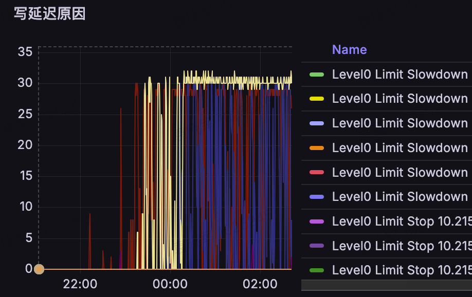
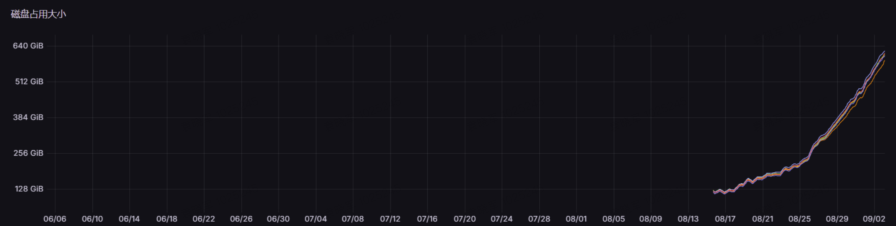

我们公司使用 `Kvrocks` 来替换大内存的 `Redis` 集群，起到了良好的效果，成本节约很可观，长期使用过程中也比较稳定，带来了良好的收益。但是在这个过程中，也遇到了一些问题，其中大部分都可以通过调整集群分片数量等手段解决，但是下面这个案例，还是算是一个“疑难杂症”的。

一个应用使用的 `Kvrocks` 集群，其实还是比较适合持久化场景的，它会源源不断地写入 `string` 类型数据，并且都有同样的 `TTL`。写入量比较恒定，所以理论上磁盘占用也会是比较稳定的，于是在初期上线的很长一段时间内，没人关注到它到底有没有异常，从业务使用角度来看，也很稳定没什么异常，直到有一天问题突然爆发。



突然出现了大量的写延迟，我们第一时间先进行了主从切换，然而故障依旧。我们查看了写降速原因，主要是 `pending compaction bytes slowdown/stop`。于是我们尝试增加后台线程数量，发现依旧无法恢复。最终我们在从节点强制 `compact`，然后做主从反转后恢复。

事后我们查看了监控以及 `RocksDB` 的日志文件，发现了一些奇怪的现象，如何将这些异常和最终的写降速关联到一起呢？

## 异常现象

### 异常的磁盘占用量

我们之前也介绍了业务的写入特性，理论上存储空间会比较稳定。我们通过监控观察异常集群的磁盘使用情况，发现磁盘占用空间在初期比较稳定，后续却不断上涨，完全不符合预期。



### `L5/L6` 文件又多又小

我们在异常集群打开了 `RocksDB` 的 `status dump` 功能，发现 `L5/L6` 磁盘占用特别大，理论上整个集群的磁盘占用应该稳定在 `100G` 左右。


从 `slowdown` 日志来看，已经积累了大约 `150G` 的 `compaction` 堆积，触发了写降速。

再仔细看 `L5/L6` 的统计指标，除了占用空间大，文件数量也很奇怪：居然达到几万甚至几十万，对应的平均文件大小只有大约 `1 MiB`，很不正常。所以我们得先弄清楚这些小文件是怎么产生的。

从 `RocksDB` 日志中，我们发现了大量小文件的移动日志：

```
[db/db_impl/db_impl_compaction_flush.cc:3819] [metadata] Moving #5296091 to level-6 1092746 bytes
EVENT_LOG_v1 {"job": 1514209, "event": "trivial_move", "destination_level": 6, "files": 1, "total_files_size": 1092746}
```

发生了大量的 `trivial move`。为什么会产生 `trivial move` 呢？这是 `RocksDB` 在 `compaction` 过程中的一种优化。如果层级 `L` 的某个 `SST` 文件和下一层 `L+1` 的文件都没有数据范围重叠，就有机会直接移到下一层。不过，光是没有重叠还不够，还得看两层的压缩配置是否兼容、当前合并任务是否允许这样移动等条件。这些条件都满足时，`RocksDB` 就可以只更新层级信息，把文件从 `L` 移到 `L+1`，不用再解压、合并和重写文件内容，省掉这部分 `IO`。

`trivial move` 按理来说合情合理，那么理论上磁盘占用应该稳定的集群，怎么会出现磁盘占用不受控制地越来越高的情况呢？

## 问题排查

### 小文件为什么一直留在 `L6`

我们大概可以看出来，大量的文件都沉在了最底层 `L6`，`Kvrocks` 内置了定时的 `compaction checker`，用来检查文件是否满足 `compact` 条件，但是带 `TTL` 的 `key` 自动过期后不会影响 `SST` 的 `deleted_keys`，即使 `L6` 的某个 `SST` 文件数据都过期了，仍旧可能不会被清理。所以 `L6` 文件越堆积越多，大致的链路是这样的：

* `SST` 文件生成时，`key` 尚未过期，`deleted_keys` 占比未达到 `compaction` 的阈值
* 与 `L6` 文件没有重叠，通过 `trivial move` 直接进入了 `L6`
* `key` 都过期了，但是 `SST` 的统计信息不会改变
* 新 `SST` 继续生成，通过 `trivial move` 直接进入 `L6`；这一 `compaction` 路径不重写 `SST` 内容，也不会执行过期过滤
* 文件不断堆积

`L6` 文件堆积的原因大概找到了，所以接下来我们得弄清楚为什么会产生那么多的小文件和 `trivial move`。

### 从 `key` 编码和数据分布找线索

为了弄清楚小文件是怎么产生的，我们不断将线上数据复制到测试集群，观察文件数量和数据分布的变化。下面关于小文件生成过程的分析，主要来自这个测试集群。我们先看看 `Kvrocks` 的 `key` 编码规则。


如上图所示，假设我们集群的 `namespace` 唯一，那么我们在集群模式下，每层的数据分布，是首先根据 `key` 的槽位 `slot` 来排序的。

我们在抓取并分析业务流量之后，发现业务使用的 `key` 是一个字典序不断递增的 `key`，可以理解为一直在追加数据。整个集群共有 16384 个槽位，但我们这次分析的实例负责的是 0–2729，共 2730 个槽位。经过 `slot` 槽位编码之后，可以理解为新数据分散到这些槽位，各自在尾部不断追加。

```text
slot 498：旧 ID …… 较新 ID …… 本轮新 ID
slot 499：旧 ID …… 较新 ID …… 本轮新 ID
slot 500：旧 ID …… 较新 ID …… 本轮新 ID
```

这个数据特性会如何影响 `Kvrocks` 使用的 `RocksDB` 在默认配置下的数据分布呢？我们在多次分析之后，发现在正常的 `compaction` 过程中，也会生成部分小文件，比如上层大约有几百 `MiB` 的文件 `compaction` 进 `L6`，那么它输出的文件结果可能是 `128 MiB`、`128 MiB`、`128 MiB`、`2 MiB`。这种是符合预期的。但是这种情况不会造成更多的小文件，我们得继续分析。

我们统计了不同日期 `L6` 的文件数量和尺寸，如下表：

| 采样日期 | `L6` 文件数 | `L6` 大小 / `GiB`（约） |
| --- | ---: | ---: |
| 09-29 | 292 | 30.47 |
| 09-30 | 344 | 30.79 |
| 10-01 | 401 | 30.32 |
| 10-02 | 461 | 29.35 |
| 10-03 | 528 | 28.57 |
| 10-04 | 625 | 29.12 |
| 10-05 | 875 | 33.38 |
| 10-06 | 1030 | 32.89 |
| 10-07 15:13 | 1155 | 30.19 |

我们可以发现 `L6` 占用的磁盘空间上升不明显，但是文件数量在不断上涨。这里首先出现了一个线索：718 个小文件中，**688 个出生于 `L5`，占 95.8%**。因此，我们得看看它们是怎么生成的，又是怎么进入 `L6` 的。

我们分析了业务的写请求，可以确认槽位分布是均衡的。但是通过 `MANIFEST` 的分析，发现了奇怪的现象，`L6` 的 737 个小文件有 626 个集中在 `slot 498`、1088，占 **84.9%**。为何小文件大量集中在这两个槽位呢？


从业务 `key` 的特性和 `Kvrocks` 的编码特性来分析，我们首先可以判定，假设 `L4` 需要合并到 `L5`，假设遇到 `slot` 的变化，比如从 498 跳到 499，那么大概率 498 和 499 中间会有一大片空隙，因为递增的 `key` 都是追加在 `key` 末尾的。从日志中我们发现了 `L5` 产生了绝大部分的小文件，是什么原因呢？

### 接近真相：提前分割

继续查看日志，同时对照 `RocksDB` 的文件分割判断，发现了一个很重要的点，就是 `L4` 向 `L5` 合并的时候，居然会同时参考 `L6` 的数据分布来确定数据要不要提前分割！

`RocksDB 9.3.1` 的 `CompactionOutputs::ShouldStopBefore` 中，这个分支的核心条件如下：

```cpp
const size_t num_skippable_boundaries_crossed =
    being_grandparent_gap_ ? 2 : 3;
if (compaction_->immutable_options()->compaction_style ==
        kCompactionStyleLevel &&
    num_grandparent_boundaries_crossed >=
        num_skippable_boundaries_crossed &&
    grandparent_overlapped_bytes_ - previous_overlapped_bytes >
        compaction_->target_output_file_size() / 8) {
  return true;
}
```

从这个实现中，我们可以看到提前分割的几个条件，以 `L4` 合并到 `L5` 为例：

* 跨越边界
  * 假设当前 `key` 落到 `L6` 某个文件中间，则需要跨越三个边界
  * 假设当前 `key` 落到 `L6` 的文件间隙中，则需要跨越两个边界
* 当前 `key` 新覆盖的文件大小

第一个条件主要是为了确保当前 `key` 和上一个 `key` 之间跨越了至少一个文件，第二个条件是当前 `key` 新覆盖的 `L6` 文件的尺寸之和。当这两个条件满足之后，当前 `key` 不会继续写入当前输出的 `SST`，而是先关闭当前文件，再以当前 `key` 为起点创建新的 `SST`，继续上述逻辑。

这个优化点主要是为了防止不必要的 `IO`。假设两个 `key` 中间跨越了下层的文件并且满足了对应的文件尺寸，那么提前切割的确是更好的选择，至少被跨越的那些文件在下次 `compaction` 时不会被选中，因为它们与输出文件的数据范围没有重叠。


我们以日志实际记录的 `compaction job` 为例，看看这个案例下是怎么触发小文件生成的。

`JOB 42980` 执行 `1@L4 + 24@L5 → L5`。输入、输出均为 50,529 条记录，生成 29 个 `SST`。

其中 #158375 处于输出序列中间，只有 **`3185 B`、1 条记录**，`key` 属于 `slot 498`。下一个输出文件 #158376 从 `slot 499` 开始。

我们分析当时的 `MANIFEST`，可以获得以下信息：

| 角色 | 文件或 `key` | 范围 / 大小 |
| --- | --- | --- |
| 已写入的 `m` | #158375 的唯一 `key` | `slot 498`；与当时 `L6` 无重叠 |
| 完整跳过的 `A` | #90521 | `slot 499` 旧 `ID`；`3,109,364 B` |
| 新进入的 `B` | #157811 | `slot 499–509`；`134,465,913 B` |
| 待写入的 `s` | #158376 的首 `key` | `slot 499`；落在 `B` 的范围内 |

从 `m` 推进到 `s`，进入 `A`、离开 `A`、进入 `B`，恰好三个边界。新增计入大小为：

```text
3,109,364 + 134,465,913 = 137,575,277 B
                           ≈ 131.2 MiB > 16 MiB
```

它满足之前说的提前分割条件。由于 `m` 本身与 `L6` 无重叠，生成的小 `SST` 随后可以通过 `trivial move` 直接进入 `L6`。我们也可以看到对应的日志：

```text
2026/10/06-12:14:36.270290 ... Moving #158375 to level-6 3185 bytes
```

### 从正常尾文件到越积越多

前面已经看到了提前切分怎么留下小文件。接下来我们再往前追一步：最初的文件边界是怎么形成的，又为什么会让小文件越积越多？

`slot 498` 和 `slot 1088` 后面，分别有一个长期保留的旧尾文件：

| 碎片集中的 `slot` | 下一 `slot` 的尾文件 | 生成时间 | 大小 |
| --- | --- | --- | ---: |
| 498 | `slot 499` 的 #90521 | 10-02 00:59:35 | `2.97 MiB` |
| 1088 | `slot 1089` 的 #73132 | 09-30 19:09:01 | `1.78 MiB` |

两者都来自正常的 `1@L5 + 5@L6 → L6` 合并：依次生成五个约 `128 MiB` 的文件，输入结束时，剩下的数据不够再凑满一个文件，就留下了一个小尾文件。这本来是正常现象，但这些尾文件长期保留下来，就可能参与后面的提前切分。

假设我们在 `L4->L5` 的合并过程中，上一个 `key` 的 `slot` 是 498，当前 `key` 的 `slot` 是 499。光知道业务写入的 `key` 单调递增，还不能确定这一步会跨过哪些文件，因为合并输出里也可能有旧记录，还得看相邻输出 `key` 和当时 `L6` 文件范围的位置关系。

在前面的样本中，上一个 `key` 位于尾文件 `A` 之前的空隙，当前 `key` 已经越过 `A`，落入后面的正常尺寸文件 `B`。这样就跨过了“进入 `A`、离开 `A`、进入 `B`”三个边界，加上 `A+B` 的尺寸大于切割阈值 `16 MiB`，便触发了提前切割。如果当前输出文件里只有少量记录，就会留下一个小文件。

这些新生成的小文件，如果和当时的 `L6` 没有重叠，而且满足 `trivial move` 的其他条件，就可以直接移入 `L6`。文件里的数据后来即使过期了，也可能一直没有被重写和清理，于是小文件就留了下来。

随着新数据继续写入，同一槽位里留下的旧文件会越来越多。当合并输出从前一个槽位推进到这个槽位的新 `key` 时，就可能跨过一串旧文件。如果新计入的文件大小超过 `16 MiB`，跨过的边界数也满足条件，进入这个槽位之前就会先切一刀；再往下走到下一个槽位时，又可能因为旧尾文件和后面的大文件再切一刀。两刀之间如果只有少量新记录，就又留下了一个小文件。

这个小文件移入 `L6` 后，又成了下一轮可以跳过的旧文件之一，让后面的切分更容易满足条件。这样，小文件就一轮一轮地积累起来了。这里变大的是旧文件串的数量和累计大小，`SST` 本身不会有尺寸的变化。


## 小文件过多为什么会导致写降速

前面我们通过测试集群，分析了小文件怎么产生、为什么会一直留在 `L6`。但这些小文件又是怎么导致写降速的呢？

在测试集群里，我们看到 `L6` 文件逐渐增多，`L5` 暂时还没有明显积压。而在异常集群里，`L5` 和 `L6` 的文件数量都已经特别大了。接下来，我们回到异常集群，看看小文件积累之后发生了什么。

我们把关注点放到 `trivial move` 上，理论上 `trivial move` 只是一个移动操作，其实它仅仅改变元数据，不会涉及任何 `SST` 的读写，那么它的执行成本应该很低吧？

我们统计了异常集群里 `trivial move` 的执行耗时，发现它越来越慢：

| 日期 | 样本数 | 平均耗时 | 中位耗时 | `P99` 耗时 |
| --- | ---: | ---: | ---: | ---: |
| 08-20 | 19,609 | 0.249 秒 | 0.248 秒 | 0.280 秒 |
| 08-24 | 24,024 | 0.436 秒 | 0.434 秒 | 0.470 秒 |
| 08-28 | 40,173 | 0.743 秒 | 0.737 秒 | 1.200 秒 |
| 08-30 | 26,334 | 1.175 秒 | 0.888 秒 | 3.285 秒 |
| 08-31 | 21,715 | 2.085 秒 | 1.903 秒 | 3.615 秒 |
| 09-01 | 22,752 | 3.140 秒 | 3.745 秒 | 4.124 秒 |
| 09-02 | 21,709 | 4.737 秒 | 4.784 秒 | 5.649 秒 |
| 09-03，主要为清理前 | 17,464 | 5.247 秒 | 5.211 秒 | 5.940 秒 |

我们可以清楚地看到，耗时随着时间不断增大，其实耗时跟着文件数量不断增大。

我们得看看 `trivial move` 到底做了什么：

```text
Moving #... 日志
    → VersionSet::LogAndApply
    → InstallSuperVersionAndScheduleWork
    → trivial_move 事件
```

为什么 `trivial move` 的成本会越来越高呢？我们继续来看看中间有什么步骤会因为文件数量过多而耗时升高。核心原因在生成新的 `Version`。`Version` 表示一个列族元数据的一个快照，包含每层的文件信息、索引、`key` 的范围等。在进行一个简单的 `trivial move` 的时候，需要生成一个新的 `Version` 来描述新的层级结构。新的 `Version` 的产生也有不少工作需要完成：

| `RocksDB 9.3.1` 中的步骤 | 与文件数量的关系 |
| --- | --- |
| `VersionBuilder::SaveSSTFilesTo` | 遍历已有文件，与新增文件合并，排除删除项，生成新版本各层的文件列表；排序对象是新增文件，并非重新排序全部旧文件 |
| `DoGenerateLevelFilesBrief` | 逐文件生成范围条目，分配内存并复制 `smallest/largest key` |
| `GenerateFileLocationIndex` | 遍历所有层的文件，建立“文件编号 → 层级、位置”的索引 |
| 层容量和 `compaction` 相关计算 | 遍历文件累计大小、计算相邻层重叠等；例如 `L5` 的重叠优先级计算也需要参考 `L6` |

所以我们可以看到，里面有遍历所有文件的过程，假设 `L6` 文件数量高达 50 多万，那么会造成比较大的压力。在 `Version` 释放的时候，同样需要进行遍历，减少引用计数。

文件数量多了，后台处理的负担也会增加。一旦下沉速度跟不上写入速度，上层就会开始积压。异常集群里的 `L5` 已经出现了这种情况，我们再结合各层容量看看。`Kvrocks` 默认开启了 `dynamic level bytes`，根据前面的 `status dump` 截图，各层的容量情况和预计合并工作量大致如下图所示：


真正触发写降速的是 `estimated pending compaction bytes` 超过了阈值。它估算的是需要完成的合并工作量，文件数量带来的处理开销，则会影响后台消化这些积压的速度。

## 如何规避这个问题

到这里，问题已经比较清楚了：小文件不断产生，移入 `L6` 后又很少被重写，里面的数据即使过期了，文件也可能一直留着。前面也提到了，`compaction checker` 依赖文件生成时收集的统计信息，难以发现这些后来才过期的数据。所以我们需要给旧文件一个重新经过过期过滤的机会。

`RocksDB` 自带了让保留时间较长的旧文件参与合并的能力，我们也提交了 `PR`，把 `rocksdb.periodic_compaction_seconds`、`rocksdb.ttl` 和 `rocksdb.daily_offpeak_time_utc` 这几个配置项接入 `Kvrocks`，方便根据业务调整。我们分析的实例中，`ttl` 和 `periodic_compaction_seconds` 都是 30 天，而业务数据的 `TTL` 只有约 12 小时，旧文件的回收节奏明显跟不上业务过期的节奏。

### 用周期合并清理留在 `L6` 的旧文件

`rocksdb.periodic_compaction_seconds` 的单位是秒，设为 0 表示关闭。这个参数可以理解为：文件长时间没有被重写，就安排它再过一遍合并流程。那些长期没有被重写的文件会成为候选，实际什么时候执行，还得看后台调度和可用资源。

这个能力对我们特别有用，因为它也能处理已经沉到最底层的 `L6` 文件。文件被选中后，可以在 `L6` 内重新处理，这条路径会实际读取和重写记录，而不是通过 `trivial move` 原样移动文件。

在这个过程中，`Kvrocks` 的 `compaction filter` 会检查记录是否过期。对于本文的 `string` 数据，`MetadataFilter` 会读取记录中的过期信息，把已经过期的记录过滤掉。如果一个小文件里的记录全部被过滤掉，旧文件就有机会从活跃版本中退出，也不需要再生成承载这些记录的新文件。这样，即使一次只处理一个小文件，也能减少文件数量，不需要先把多个小文件凑成一个大文件。

### `rocksdb.ttl` 能做什么

`rocksdb.ttl` 的名字容易让人想到业务数据的过期时间，但它关注的是旧文件已经保留了多久，单位同样是秒，设为 0 表示关闭这条按保留时长触发的合并路径。它不会替业务设置 `key` 的 `TTL`，也不会因为文件保留时间超过门槛，就把里面的有效数据全部删除。

在本文使用的 `RocksDB 9.3.1` 中，比较老的文件可以通过这条路径被选中，向下一层合并。即使当前层还没达到容量合并的条件，也有机会推动这些旧文件下沉，并在实际重写时清理过期记录。

不过，这条路径主要处理还有下一层可以合并的文件。我们这里的大量小文件已经留在最底层 `L6`，所以仅靠调小 `rocksdb.ttl`，不能替代周期合并对这些文件的重写。它可以帮助上层旧数据获得额外的处理机会，而回收 `L6` 碎片，主要还是靠 `rocksdb.periodic_compaction_seconds`。

| 配置 | 主要作用 | 在本文场景中的作用 |
| --- | --- | --- |
| `rocksdb.periodic_compaction_seconds` | 让长期未重写的文件获得周期重写机会，包括最底层文件 | 清理留在 `L6` 的过期碎片 |
| `rocksdb.ttl` | 根据旧文件的保留时间推动向下一层合并 | 为上层旧数据提供额外的合并和清理机会 |
| `rocksdb.daily_offpeak_time_utc` | 让部分即将到期的周期任务提前利用低峰窗口 | 帮助安排周期合并的执行时机 |

这两个参数负责给旧文件提供处理机会，记录是否过期，仍然由业务设置的 `TTL` 和 `Kvrocks` 的过滤逻辑决定。

### 为什么适合我们的业务

我们这个业务持续写入字典序递增的新 `key`，旧的小文件很少再混入新数据，而且记录的 `TTL` 都差不多。这样，一个小文件如果只保存了较短时间内写入的一批数据，在没有续期的情况下，里面的记录通常会陆续全部过期。

只要周期合并重新处理这些文件，过期记录就有机会被清掉，旧碎片也就能持续退出 `L6`。新的小文件可能还会产生，但旧文件能及时清理，数量就不会一直随着历史写入往上涨。旧尾文件和旧碎片串被清理后，也可能改变后续提前切分所依赖的文件边界。


如果一个文件里长期混着不过期的数据，或者记录不断被续期，重写后仍可能留下文件。所以这个方案能减少多少碎片，也和业务数据的生命周期有关。

### 周期怎么设置，效果怎么看

在我们这个场景中，我们把周期调整为 12 小时后，文件数量保持稳定，集群不再出现写降速，解决了这个问题。对应的配置是：

```conf
rocksdb.periodic_compaction_seconds 43200
```

这里的 12 小时是用来判断文件是否需要周期合并的时间门槛，不能理解成每隔 12 小时整库合并一次，也不保证业务 `key` 到期后立即回收。文件多久没有被重写，和里面的记录什么时候过期，并不是一回事。文件达到条件后，还需要等待后台调度。

周期越短，旧文件获得处理机会越频繁，后台读写也会增加。所以不能只看业务 `TTL` 就机械地设置同样的周期，还得结合文件数量、磁盘占用、合并积压和写延迟观察效果。对我们来说，关键是旧的小文件能持续被清理，后台回收速度跟得上新文件产生的速度。

如果希望更多地利用低峰时段，可以配合 `rocksdb.daily_offpeak_time_utc`。它按 `UTC` 配置时间窗口，允许部分即将达到周期条件的文件提前参与调度，但不是所有合并都只能在这个窗口内执行，也不能保证任务一定在窗口结束前完成。

调整之后，我们还可以从日志里看有没有 `PeriodicCompaction` 任务，再结合旧文件是否被重写和移除、小文件数量是否还在持续增长，以及后台读写和业务延迟的变化，判断这个周期是否合适。只看 `pending bytes` 暂时降到 0，还不足以说明碎片问题已经解决。

### 把每层文件数量也监控起来

回头看这次问题，如果早点注意到文件数量的变化，应该能更早发现异常。所以后来我又提了一个 `PR`，把每层 `SST` 文件数量的指标暴露出来，方便接入监控。除了磁盘占用和写入延迟，我们也可以直接看到 `LSM tree` 各层的文件数量是怎么变化的。

具体可以通过 `INFO rocksdb` 查看。以我们重点关注的 `metadata` 列族为例，文件数量的输出类似这样：

```text
num_files_at_level[metadata]:[0,0,0,3,3,88,705]
```

方括号里的 `metadata` 表示列族，后面列表中的数字，从左到右依次对应 `L0` 到 `L6` 的文件数量。比如这个例子里，`L0`、`L1`、`L2` 都没有文件，`L3` 和 `L4` 各有 3 个，`L5` 有 88 个，`L6` 有 705 个。它统计的是当前各层的文件数量，单位是个，不是文件大小，也不是累计生成过多少文件。接入监控时，可以把列表拆成每层一条曲线，分别观察。

除了文件数量，还可以一起看预计合并工作量：

| 指标 | 含义 | 怎么结合起来看 |
| --- | --- | --- |
| `num_files_at_level[metadata]` | `metadata` 列族从 `L0` 到 `L6` 的当前 `SST` 文件数量 | 看文件是否持续增多，以及主要积在哪一层 |
| `estimate_pending_compaction_bytes[metadata]` | 这个列族预计还需要完成的合并工作量，单位是字节 | 看按容量计算的合并压力是否也在增加 |

这两个指标反映的情况不一样。文件数量上涨时，预计合并工作量不一定马上跟着上涨，所以最好放在一起看。其他列族也有对应的指标，名字里的 `metadata` 换成相应的列族名称即可。

前面测试集群的例子就是一个很好的提醒：`L6` 占用的空间一直在 `30 GiB` 左右，但文件数量却从几百个涨到了一千多个。如果只看磁盘占用，这个变化很容易被忽略；把文件数量也画成趋势，就能看到数据量差不多，文件却越来越碎了。

实际观察时，可以按列族分别看各层的文件数量，我们这个场景尤其需要关注 `metadata`。比如写入量没有明显变化，`L6` 的文件数量却持续上涨，就值得看看是不是小文件不断留下来了。如果后面连 `L5` 的文件数量也开始明显增加，再结合各层占用空间和合并积压，就能进一步判断后台下沉是不是已经跟不上了。

告警也可以围绕这些变化来设置。不同集群的数据量和目标文件大小不一样，没必要套一个统一的文件数量阈值，可以先看看正常运行时各层大概有多少文件，再关注持续增长和明显偏离平时水平的情况。正常合并也会让文件数量有起伏，重点是这些变化是否一直没有恢复。这样，就有机会在写降速之前发现 `LSM tree` 的结构已经开始偏离正常状态，提前检查文件分布和回收情况。

## 总结

回头看这次问题，麻烦的地方在于，它是几个过程碰到一起，慢慢积累出来的。业务持续写入递增的 `key`，经过 `slot` 编码后，遇到特定的历史文件边界，提前切分就可能留下很小的 `SST`。这些文件又通过 `trivial move` 原样进入 `L6`，很少有机会重新经过过期过滤，数量就一轮一轮地涨了上去。等到后台处理的负担越来越大，上层也开始积压，最后才表现为业务看到的写降速。

这次也让我们更直观地理解了，业务数据过期和磁盘空间回收之间，还有一段距离。`key` 已经读不到了，并不意味着承载它的文件马上就会被清掉。对于持续写新数据、很少再覆盖旧范围的业务，旧文件可能长期没有重写机会。排查时，除了看业务的 `TTL`，也得看看这些过期数据有没有真正经过过滤、退出活跃文件集合。

处理上，我们先通过手工合并回收已有的积压，再把周期合并的节奏调整到适合业务的范围，让旧文件能持续得到处理。这个办法对我们的场景比较有效，因为旧的小文件里很少混入新数据，记录的过期时间也比较接近。新的小文件仍可能产生，但旧碎片能不断被清理，文件数量就能保持稳定。换一种业务，如果数据经常续期，或者同一个文件里混着很多不过期的记录，就还得结合实际情况观察效果。

监控上，我们也补上了各层 `SST` 文件数量这个维度。磁盘占用看着稳定，文件数量却一直增加，同样值得关注。把各层文件数量、占用空间、合并积压和业务延迟放在一起看，才能更早发现后台处理和回收是不是出了问题。希望把这次排查过程分享出来，能让遇到类似场景的人少走一些弯路，也让 `Kvrocks` 持续稳定地为业务提供服务。
